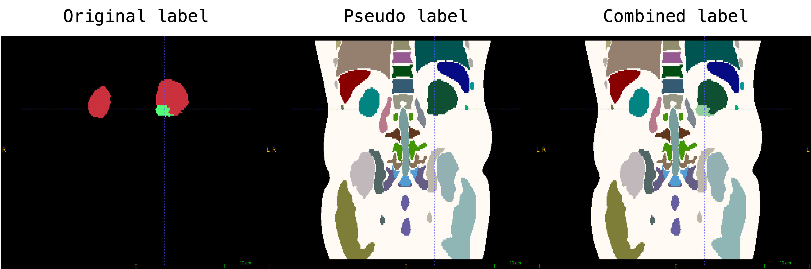

# Medical AI for Synthetic Imaging (MAISI) Data Preparation

Disclaimer: We do not host these datasets. Please read each dataset's requirements and usage policies and give credit to the authors.

## Table of Contents

- [1 Model versions and checkpoints](#1-model-versions-and-checkpoints)
- [2 VAE training data](#2-vae-training-data)
  - [2.1 autoencoder_v1.pt](#21-autoencoder_v1pt)
  - [2.2 autoencoder_v2.pt](#22-autoencoder_v2pt)
- [3 Diffusion model training data](#3-diffusion-model-training-data)
  - [3.1 diff_unet_3d_ddpm-ct.pt](#31-diff_unet_3d_ddpm-ctpt)
  - [3.2 diff_unet_3d_rflow-ct.pt](#32-diff_unet_3d_rflow-ctpt)
  - [3.3 diff_unet_3d_rflow-mr.pt](#33-diff_unet_3d_rflow-mrpt)
- [4 ControlNet model training data](#4-controlnet-model-training-data)
  - [4.1 controlnet_3d_ddpm-ct.pt](#41-controlnet_3d_ddpm-ctpt)
  - [4.2 controlnet_3d_rflow-ct.pt](#42-controlnet_3d_rflow-ctpt)
  - [4.3 Example: finetuning on a new dataset](#43-example-finetuning-on-a-new-dataset)
- [5 Questions and bugs](#5-questions-and-bugs)
- [Reference](#reference)

## 1 Model versions and checkpoints

The table below shows which checkpoints are downloaded for each model version (via `scripts/download_model_data.py`).

| Version | Checkpoints |
|---------|-------------|
| `rflow-mr-brain` | `autoencoder_v1.pt`, `diff_unet_3d_rflow-mr-brain_v0.pt` |
| `ddpm-ct` | `autoencoder_v1.pt`, `mask_generation_autoencoder.pt`, `mask_generation_diffusion_unet.pt`, `diff_unet_3d_ddpm-ct.pt`, `controlnet_3d_ddpm-ct.pt` |
| `rflow-ct` | `autoencoder_v1.pt`, `mask_generation_autoencoder.pt`, `mask_generation_diffusion_unet.pt`, `diff_unet_3d_rflow-ct.pt`, `controlnet_3d_rflow-ct.pt` |
| `rflow-mr` | `autoencoder_v2.pt`, `diff_unet_3d_rflow-mr.pt` |

## 2 VAE training data

### 2.1 autoencoder_v1.pt

For the released Foundation autoencoder model weights autoencoder_v1.pt, we used 37,243 CT training volumes and 1,963 CT validation volumes from the chest, abdomen, and head-and-neck regions, and 17,887 MRI training volumes and 940 MRI validation volumes from the brain, skull-stripped brain, chest, and below-abdomen regions. The training data comes from
[TCIA Covid 19 Chest CT](https://wiki.cancerimagingarchive.net/display/Public/CT+Images+in+COVID-19#70227107b92475d33ae7421a9b9c426f5bb7d5b3),
[TCIA Colon Abdomen CT](https://wiki.cancerimagingarchive.net/pages/viewpage.action?pageId=3539213),
[MSD03 Liver Abdomen CT](http://medicaldecathlon.com/),
[LIDC chest CT](https://www.cancerimagingarchive.net/collection/lidc-idri/),
[TCIA Stony Brook Covid Chest CT](https://www.cancerimagingarchive.net/collection/covid-19-ny-sbu/),
[NLST Chest CT](https://www.cancerimagingarchive.net/collection/nlst/),
[TCIA Upenn GBM Brain MR](https://wiki.cancerimagingarchive.net/pages/viewpage.action?pageId=70225642),
[Aomic Brain MR](https://openneuro.org/datasets/ds003097/versions/1.2.1),
[QTIM Brain MR](https://openneuro.org/datasets/ds004169/versions/1.0.7),
[TCIA Acrin Chest MR](https://www.cancerimagingarchive.net/collection/acrin-contralateral-breast-mr/),
[TCIA Prostate MR Below-Abdomen MR](https://wiki.cancerimagingarchive.net/pages/viewpage.action?pageId=68550661#68550661a2c52df5969d435eae49b9669bea21a6).

In total, we included these datasets in autoencoder_v1.pt. The model is open source and may be used for both research and commercial purposes. You can find the license at [NV-Generate-CT](https://huggingface.co/nvidia/NV-Generate-CT).

| Index | Dataset Name                                   | Number of training volumes | Number of validation volumes |
|-------|------------------------------------------------|----------------------------|------------------------------|
| 1     | Covid 19 Chest CT                              | 722                     | 49                        |
| 2     | TCIA Colon Abdomen CT                          | 1522                    | 77                        |
| 3     | MSD03 Liver Abdomen CT                         | 104                     | 0                         |
| 4     | LIDC chest CT                                  | 450                     | 24                        |
| 5     | TCIA Stony Brook Covid Chest CT                | 2644                    | 139                       |
| 6     | NLST Chest CT                                  | 31801                   | 1674                      |
| 7     | TCIA Upenn GBM Brain MR (skull-stripped)       | 2550                    | 134                       |
| 8     | Aomic Brain MR                                 | 2630                    | 138                       |
| 9     | QTIM Brain MR                                  | 1275                    | 67                        |
| 10    | Acrin Chest MR                                 | 6599                    | 347                       |
| 11    | TCIA Prostate MR Below-Abdomen MR              | 928                     | 49                        |
| 12    | Aomic Brain MR, skull-stripped                 | 2630                    | 138                       |
| 13    | QTIM Brain MR, skull-stripped                  | 1275                    | 67                        |
|       | Total CT (v1)                                      | 37243                   | 1963                      |
|       | Total MRI (v1)                                     | 17887                   | 940                       |

### 2.2 autoencoder_v2.pt

For the released Foundation autoencoder model weights autoencoder_v2.pt, we added the following datasets on top of the data above. Those sources are openly available for research under their respective licenses but are not cleared for commercial use; autoencoder_v2.pt is offered on the same basis—research use only, not commercial use. You can find the license at [NV-Generate-MR](https://huggingface.co/nvidia/NV-Generate-MR).

Additional training data comes from
[HNSCC Head and neck CT](https://www.cancerimagingarchive.net/collection/hnscc/),
[AbdomenCT-1K Abdomen CT](https://github.com/JunMa11/AbdomenCT-1K),
[TotalSegmentatorV2 Whole body CT](https://zenodo.org/records/10047292),
[amos22_unlabeled_mri_7000_8199 Abdomen MR](https://amos22.grand-challenge.org/),
[DukeLiver Abdomen MR](https://zenodo.org/records/7774566),
[SPIDER spine MR](https://spider.grand-challenge.org/),
[MSD02 heart MR](http://medicaldecathlon.com/),
[PanSeg Abdomen MR](https://osf.io/kysnj/).

| Index | Dataset Name                                   | Number of training volumes | Number of validation volumes |
|-------|------------------------------------------------|----------------------------|------------------------------|
| 14     | HNSCC Head and neck CT                              | 1164                    | 61                        |
| 15     | AbdomenCT-1K Abdomen CT                              | 640                     | 160                       |
| 16     | TotalSegmentatorV2 Whole body CT                              | 784                     | 196                       |
| 17     | amos22_unlabeled_mri_7000_8199 Abdomen MR                 | 1077                    | 120                       |
| 18     | DukeLiver Abdomen MR                 | 155                     | 39                        |
| 19     | SPIDER spine MR                 | 403                     | 44                        |
| 20     | MSD02 heart MR                 | 12                      | 4                         |
| 21     | PanSeg Abdomen MR        | 490                     | 123                       |
|       | Total CT (v2)                             | 39831                   | 2380                      |
|       | Total MRI (v2)                            | 20024                   | 1270                      |

## 3 Diffusion model training data

### 3.1 diff_unet_3d_ddpm-ct.pt

The training dataset for this diffusion model comprises 10,277 CT volumes from 24 distinct datasets, encompassing various body regions and disease patterns.

The table below provides a summary of the number of volumes for each dataset.

|Index| Dataset name|Number of volumes|
|:-----|:-----|:-----|
1  | AbdomenCT-1K | 789
2  | AeroPath | 15
3  | AMOS22 | 240
4  | autoPET23 | 200
5  | Bone-Lesion | 223
6  | BTCV | 48
7  | COVID-19 | 524
8  | CRLM-CT | 158
9  | CT-ORG | 94
10 | CTPelvic1K-CLINIC | 94
11 | LIDC | 422
12 | MSD Task03 | 88
13 | MSD Task06 | 50
14 | MSD Task07 | 224
15 | MSD Task08 | 235
16 | MSD Task09 | 33
17 | MSD Task10 | 87
18 | Multi-organ-Abdominal-CT | 65
19 | NLST | 3109
20 | Pancreas-CT | 51
21 | StonyBrook-CT | 1258
22 | TCIA_Colon | 1437
23 | TotalSegmentatorV2 | 654
24 | VerSe | 179

### 3.2 diff_unet_3d_rflow-ct.pt

For this model, we added HNSCC CT on top of the data above.

|Index| Dataset name|Number of volumes|
|:-----|:-----|:-----|
25  | HNSCC | 1225

### 3.3 diff_unet_3d_rflow-mr.pt

The training dataset for this diffusion model comprises 16,291 distinct MR volumes from 17 source datasets, spanning multiple body regions. Any volume with fewer than 48 slices was excluded before training to keep data quality consistent.

|Index| Dataset name|T1w|T2w|FLAIR|DWI|ADC|PD|MRA|bSSFP|unknown contrast|original volumes|training volumes|
|:-----|:-----|:-----|:-----|:-----|:-----|:-----|:-----|:-----|:-----|:-----|:-----|:-----|
1  | QTIM Brain| 1328 | 0 | 0 | 0 | 0 | 0 | 0 | 0 | 0 | 1342 | 1328
2  | AOMIC Brain| 2750 | 0 | 0 | 0 | 0 | 0 | 0 | 0 | 0 | 2768 | 2750
3  | IXI Brain| 581 | 577 | 0 | 0 | 0 | 577 | 569 | 0 | 0 | 2306 | 2304
4  | LUMIR Brain| 3967 | 0 | 0 | 0 | 0 | 0 | 0 | 0 | 0 | 3984 | 3967
5  | ISLES2022 Brain| 0 | 0 | 152 | 196 | 196 | 0 | 0 | 0 | 0 | 750 | 544
6  | ACRIN Breast| 1882 | 90 | 0 | 0 | 0 | 0 | 0 | 0 | 1165 | 6946 | 3137
7  | TCIA Prostate MR| 0 | 898 | 0 | 0 | 0 | 0 | 0 | 0 | 0 | 977 | 898
8  | CirrMRI600+ Abdomen| 362 | 6 | 0 | 0 | 0 | 0 | 0 | 0 | 0 | 738 | 368
9  | AMOS22 Abdomen| 0 | 0 | 0 | 0 | 0 | 0 | 0 | 0 | 60 | 60 | 60
10 | DukeLiver Abdomen| 240 | 0 | 0 | 0 | 0 | 0 | 0 | 0 | 0 | 243 | 240
11 | TotalSegmentatorMR| 0 | 0 | 0 | 0 | 0 | 0 | 0 | 0 | 136 | 298 | 136
12 | PanSeg Abdomen| 113 | 72 | 0 | 0 | 0 | 0 | 0 | 0 | 0 | 767 | 185
13 | amos22_unlabeled_mri_7000_8199 Abdomen| 0 | 0 | 0 | 0 | 0 | 0 | 0 | 0 | 236 | 1199 | 236
14 | MSD Task02 Cardiac| 0 | 0 | 0 | 0 | 0 | 0 | 0 | 30 | 0 | 30 | 30
15 | SPIDER Spine| 16 | 57 | 0 | 0 | 0 | 0 | 0 | 0 | 0 | 447 | 73
16 | Sunnybrook Cardiac MR | 0 | 0 | 0 | 0 | 0 | 0 | 0 | 0 | 12 | 1071 | 12
17 | QIN-PROSTATE-Repeatability| 16 | 7 | 0 | 0 | 0 | 0 | 0 | 0 | 0 | 120 | 23
| | Total | 11255 | 1707 | 152 | 196 | 196 | 577 | 569 | 30 | 1609 | 24046 | 16291

## 4 ControlNet model training data

### 4.1 controlnet_3d_ddpm-ct.pt

The ControlNet training dataset used in MAISI contains 6,330 CT volumes (5,058 for training and 1,272 for validation) across 20 datasets and covers different body regions and diseases.

The table below summarizes the number of volumes for each dataset.

|Index| Dataset name|Number of volumes|
|:-----|:-----|:-----|
1 | AbdomenCT-1K | 789
2 | AeroPath | 15
3 | AMOS22 | 240
4 | Bone-Lesion | 237
5 | BTCV | 48
6 | CT-ORG | 94
7 | CTPelvic1K-CLINIC | 94
8 | LIDC | 422
9 | MSD Task03 | 105
10 | MSD Task06 | 50
11 | MSD Task07 | 225
12 | MSD Task08 | 235
13 | MSD Task09 | 33
14 | MSD Task10 | 101
15 | Multi-organ-Abdominal-CT | 64
16 | Pancreas-CT | 51
17 | StonyBrook-CT | 1258
18 | TCIA_Colon | 1436
19 | TotalSegmentatorV2 | 654
20 | VerSe | 179

### 4.2 controlnet_3d_rflow-ct.pt

For this model, we added HNSCC CT on top of the data in [§4.1](#41-controlnet_3d_ddpm-ctpt).

|Index| Dataset name|Number of volumes|
|:-----|:-----|:-----|
21  | HNSCC | 1225

### 4.3 Example: finetuning on a new dataset

This section walks through finetuning the **pretrained CT ControlNet** to learn a **new class** (Kidney Tumor) on a subset of [C4KC-KiTS](https://www.cancerimagingarchive.net/collection/c4kc-kits/). We ship the already-preprocessed subset so you can reproduce the example immediately; the [next subsection](#generating-the-preprocessed-files-from-your-own-image-and-mask) then explains how to produce the same files from your *own* image + mask.

#### Download the example dataset

Download the [dataset zip](https://developer.download.nvidia.com/assets/Clara/monai/tutorials/model_zoo/model_maisi_C4KC-KiTS_subset.zip) and its [JSON data list](https://developer.download.nvidia.com/assets/Clara/monai/tutorials/model_zoo/model_maisi_C4KC-KiTS_subset.json), then unzip so that the repository root contains:

```text
datasets/
├── C4KC-KiTS_subset/          # one folder per case (see layout below)
└── C4KC-KiTS_subset.json      # data list consumed by training
```

These two paths match `data_base_dir` and `json_data_list` in the finetuning configs (`configs/environment_maisi_controlnet_train*.json`).

#### Per-case folder layout

Each case folder holds five files. **You only ever author the two `original` files**; the other three are produced by the preprocessing steps in the next subsection.

```text
            |-*arterial*.nii.gz               # original image          (you provide)
            |-*arterial_emb*.nii.gz           # VAE-encoded image embedding   (derived)
KiTS-000* --|-mask*.nii.gz                    # original mask           (you provide)
            |-mask_pseudo_label*.nii.gz       # NV-Segment labels + body (200)  (derived)
            |-mask_combined_label*.nii.gz     # pseudo labels + your mask     (derived)
```

An example combined mask of original and pseudo labels is shown below:


#### Generating the preprocessed files from your own image and mask

> 💡 **Step-by-step guide:** [`skills/finetune_image-from-mask_data-prep.md`](../skills/finetune_image-from-mask_data-prep.md) walks through this end to end — embeddings, NV-Segment pseudo labels, remapping a new class onto a free label index, building the JSON, and launching finetuning.

Starting from an `original image` and an `original mask`, the three derived files are produced as follows:

1. **Image embedding (`*_emb.nii.gz`).** VAE-encode the original image with `scripts/diff_model_create_training_data.py`. For each image it resamples to the nearest multiple of 128 per axis, runs the autoencoder encoder (`encode_stage_2_inputs`, sliding-window, under AMP), and saves the latent as `<image>_emb.nii.gz`. Set `trained_autoencoder_path` to `./models/autoencoder_v1.pt` and point `data_base_dir` / `json_data_list` / `embedding_base_dir` at your data via an `environment_*` config. Encoding once up front (instead of inside the training loop) is what keeps GPU memory low during ControlNet training. *Note: this script reads a `modality` field per JSON entry (e.g. `"ct"`).*

2. **Pseudo labels (`mask_pseudo_label*.nii.gz`).** Produce a MAISI-vocabulary whole-body segmentation **with the body envelope (`200`) added** by following Option A in the [image-from-mask skill](../skills/infer_image-from-mask.md#producing-a-valid-mask-from-a-ct-image): run [NV-Segment](https://github.com/NVIDIA-Medtech/NV-Segment-CTMR) (a **separate tool**, not part of this repo) on the original image, then `scripts.utils.add_body_envelope(seg, ct_image)`. NV-Segment emits organ labels only and **never** label `200`, so the `add_body_envelope` step is required — it fills every non-organ body voxel with `200` from the CT HU values. This adds the anatomical context the ROI-only mask lacks.

3. **Combined labels (`mask_combined_label*.nii.gz`).** Overlay your original mask onto the Step-2 pseudo label: remap your ROI to its target index (Kidney Tumor → `129` in this example) and write it on top. This combined mask is what the ControlNet is conditioned on. The repo provides the `remap_labels` helper (`scripts/utils.py`); the merge itself is a small label-overlay step you assemble for your data.

When teaching a class other than Kidney Tumor, remap it to **any unclaimed integer in `0–255`** — anything not already used by a MAISI class and not `0`/`200`; the free ranges `133–199` and `201–255` collide with nothing, and the eight `dummy` slots in [`label_dict.json`](../configs/label_dict.json) (e.g. `129`) are pre-named for convenience. Set that index as `weighted_loss_label` in the training config and add a named entry for it to `label_dict.json`. See [docs/training.md](../docs/training.md#3d-controlnet-training) for the full guidance and launch commands.

#### Data list JSON

The training workflow needs one JSON file pairing each image embedding with its combined-label mask. The example is `datasets/C4KC-KiTS_subset.json`:

```python
{
    "training": [
        {
            "image": "*/*arterial_emb*.nii.gz",       # image embedding, path relative to data_base_dir
            "label": "*/mask_combined_label*.nii.gz", # combined label, path relative to data_base_dir
            "dim": [512, 512, 512],                   # original (resampled) volume dimensions — informational
            "spacing": [1.0, 1.0, 1.0],               # voxel spacing
            "top_region_index": [0, 1, 0, 0],         # ddpm-ct ONLY — omit for rflow-ct
            "bottom_region_index": [0, 0, 0, 1],      # ddpm-ct ONLY — omit for rflow-ct
            "modality": "ct",                         # used when generating embeddings (step 1)
            "fold": 0  # cross-validation fold. An item is held out for VALIDATION when its
                       # "fold" equals "fold" in config_maisi_controlnet_train*.json (default 0),
                       # and used for TRAINING otherwise. So with the default config, fold 0 = validation.
        },

        ...
    ]
}
```

The loader requires `image`, `label`, and `spacing`; `dim` is informational. `top_region_index` / `bottom_region_index` are needed **only for `ddpm-ct`** (its `config_network_ddpm.json` sets `include_body_region: true`); **`rflow-ct` sets `include_body_region: false` and ignores them**, so you can omit them. Assign items to multiple folds (e.g. `0`, `1`, `2`, …) so the held-out fold gives you a non-empty validation set.

## 5 Questions and bugs

- For questions about using MONAI, please use the [Discussions tab](https://github.com/Project-MONAI/MONAI/discussions) on the main MONAI repository.
- For bugs in MONAI functionality, please create an issue on the [main repository](https://github.com/Project-MONAI/MONAI/issues).
- For bugs when running a tutorial, please create an issue in [this repository](https://github.com/Project-MONAI/Tutorials/issues).

## Reference

[1] [Rombach, Robin, et al. "High-resolution image synthesis with latent diffusion models." CVPR 2022.](https://openaccess.thecvf.com/content/CVPR2022/papers/Rombach_High-Resolution_Image_Synthesis_With_Latent_Diffusion_Models_CVPR_2022_paper.pdf)
